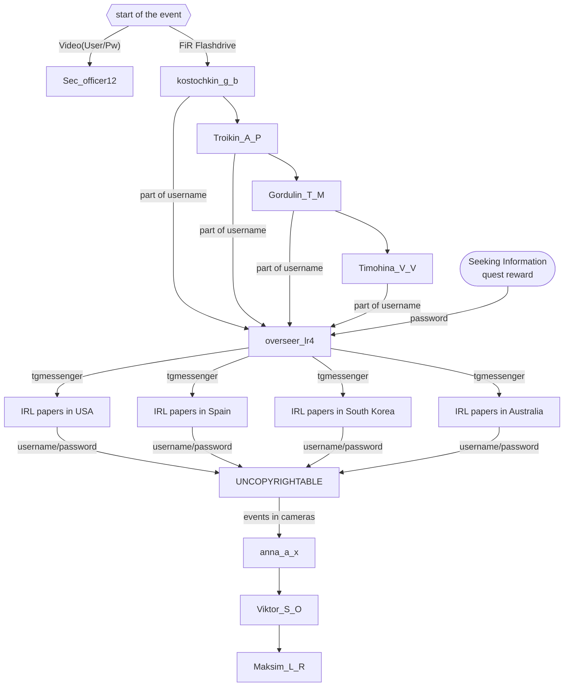

# ARRS season 6

## Users
| Username | Password | Unlock time | Status |
|----------|----------|-------------|--------|
| [Sec_officer12](https://github.com/3ncy/ARRS-s6/blob/main/Users/Sec_officer12.md) | 321654test | Start of the event | DONE |
| [kostochkin_g_b](https://github.com/3ncy/ARRS-s6/blob/main/Users/kostochkin_g_b.md) | rfi23c945ldm2RT7G123 | 16:57 CEST 15.05. | WIP |
| [Troikin_A_P](https://github.com/3ncy/ARRS-s6/blob/main/Users/Troikin_A_P.md) | dG8gdGhlIGhlYXJ0 | 08:26 CEST 16.05. | WIP |
| [Gordulin_T_M](https://github.com/3ncy/ARRS-s6/blob/main/Users/Gordulin_T_M.md) | c3Rvcm1pc2hlcmUu | 09:44 CEST 16.05. | WIP |
| [Timohina_V_V](https://github.com/3ncy/ARRS-s6/blob/main/Users/Timohina_V_V.md) | aXRzdXB0b3lvdS4u | 11:47 CEST 16.05. | WIP |
| [overseer_lr4](https://github.com/3ncy/ARRS-s6/blob/main/Users/overseer_lr4.md) | bmV3ZGF3bi4u | 13:12 CEST 16.02. | WIP |
| [UNCOPYRIGHTABLE](https://github.com/3ncy/ARRS-s6/blob/main/Users/UNCOPYRIGHTABLE.md) | ji32nfj32mf0mkewb209 | 20:38 CEST 17.05. | DONE |
| [anna_a_x](https://github.com/3ncy/ARRS-s6/blob/main/Users/anna_a_x.md) | qvvos_zp_bfqvzku_yb | 21:28 CEST 17.05. | DONE |
| [Viktor_S_O](https://github.com/3ncy/ARRS-s6/blob/main/Users/Viktor_S_O.md) | fv_yik_vcl_xfv_x_zvdsea_tf | 22:22 CEST 17.05. | DONE |
| [Maksim_L_R](https://github.com/3ncy/ARRS-s6/blob/main/Users/Maksim_L_R.md) | o_rzpqfojvowed_hyfg_fks_cbuvkr_z_pop | 13:17 CEST 18.05 | DONE |

### IRL things
Papers found on the IRL locations:

- List of Papers by Category w/ Decoded Text: [papers](https://github.com/3ncy/ARRS-s6/blob/main/Users/RegionalPapers.md)
- USA: [info](https://github.com/3ncy/ARRS-s6/tree/main/Users/USA), [papers](https://github.com/3ncy/ARRS-s6/tree/main/Files/papers-usa) found there
- Spain: [info](https://github.com/3ncy/ARRS-s6/tree/main/Users/Spain), [papers](https://github.com/3ncy/ARRS-s6/tree/main/Files/papers-spain)
- South Korea: [info](https://github.com/3ncy/ARRS-s6/tree/main/Users/Korea), [papers](https://github.com/3ncy/ARRS-s6/tree/main/Files/papers-korea)
- Australia: [info](https://github.com/3ncy/ARRS-s6/tree/main/Users/Australia), [papers](https://github.com/3ncy/ARRS-s6/tree/main/Files/papers-australia)

## Possible users
- 

## Unused stuff
- lines `d{6` and `dt*` from [kostochkin_g_b: TempData.data](https://github.com/3ncy/ARRS-s6/blob/main/Users/kostochkin_g_b.md#tempdatadata)
