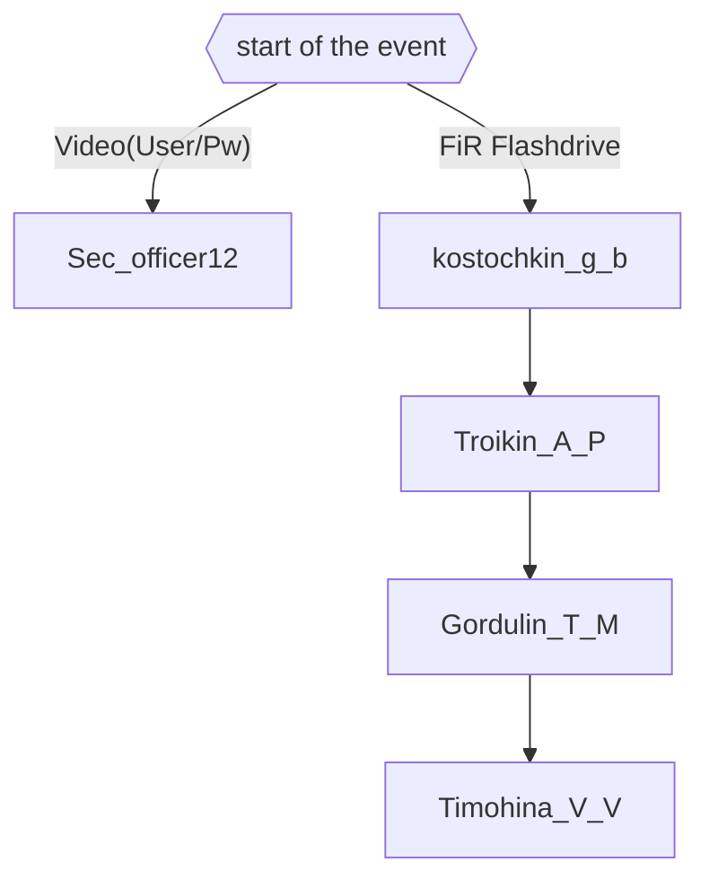

# ARRS season 6

## Users
| Username | Password | Unlock time | Status |
|----------|----------|-------------|--------|
| [Sec_officer12](./Users/Sec_officer12.md) | 321654test | Start of the event | done |
| [kostochkin_g_b](./Users/kostochkin_g_b.md) | rfi23c945ldm2RT7G123 | 16:57 CEST 15.05. | WIP |
| [Troikin_A_P](./Users/Troikin_A_P.md) | dG8gdGhlIGhlYXJ0 | 08:26 CEST 16.05. | WIP |
| [Gordulin_T_M](./Users/Gordulin_T_M.md) | c3Rvcm1pc2hlcmUu | 09:44 CEST 16.05. | WIP |
| [Timohina_V_V](./Users/Timohina_V_V.md) | aXRzdXB0b3lvdS4u | 11:47 CEST 16.05. | WIP |

### Possible users
- 

## Unused stuff
- endings of the chatlog files in [kostochkin_g_b](./Users/kostochkin_g_b.md) (like `_D111` etc)
- endings of the chatlog files in [Troikin_A_P](./Users/Troikin_A_P.md) (like `_101Y` etc)
- endings o fthe chatlog files in [Gordulin_T_M](./Users/Gordulin_T_M.md) (like `_114T` etc)
