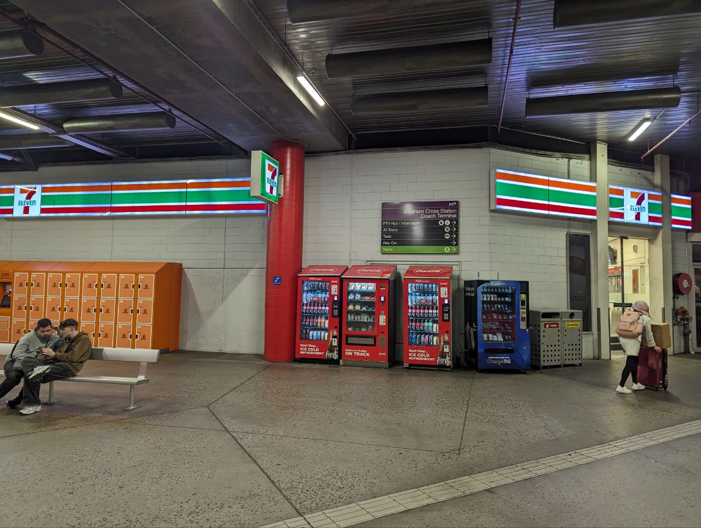

A message from @agent12c5 on telegram:
> Australia Package details:
> 
> https://drive.google.com/drive/u/3/folders/1qqBRKtttd2DhY0vznsAvJb1jGXhhRufF
> 
> As other agents in different locations you also have to make sure you found everything we need, get in touch with me!

The google drive is titled "Melbourne. Part 1" and contains two files: `coordinates` and `22.jpg`

### coordinates:
> coordinates: -37.816269, 144.952491 
> Locker: 822 
> Code: 827568 Purple

Which is here [map link]

### 22.jpg

### Retrieved papers
Can be found in the folder [Files/papers-australia in the **papers** branch](https://github.com/3ncy/ARRS-s6/tree/papers/Files/papers-australia)
