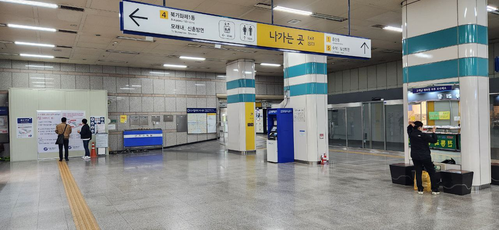

A message from @agent12c5 on telegram:
> South Korea Package details:
> 
> https://drive.google.com/drive/u/3/folders/1i9vVmDhrcRT9oiW3iDVtNq5akTsyv6Su
> 
> As other agents in different locations you also have to make sure you found everything we need, get in touch with me!

The google drive is titled "South Korea. Part 1" and contains two files: `coordinates` and `333f.jpg`

### coordinates:
> 37.577328,126.902163 
> Storage 9 
> Password for box: 0525 
> Storage won't be openable during 00:00 - 05:00

Which is here: [map link]

### 333f.jpg

### Retrieved papers
Can be found in the folder [Files/papers-korea on the papers branch](https://github.com/3ncy/ARRS-s6/tree/papers/Files/papers-korea)
