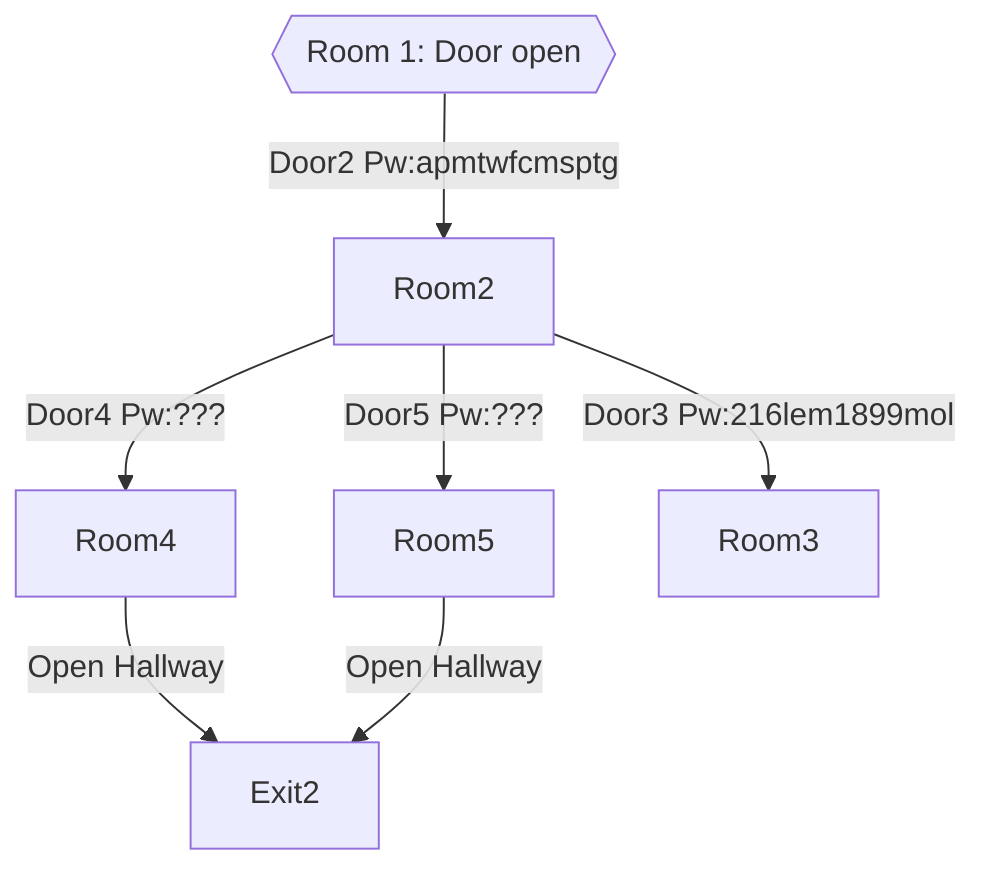

# overseer_lr4:bmV3ZGF3bi4u
## user
```
Login: overseer_lr4
Access level: overseer
Name: -
Status: Active

# # # # # # # # # # # #

Description:
Special account assigned to a USEC security company employee

# # # # # # # # # # # #

Notes:

Book : The Song of Sword (칼의 노래) by Kim Hoon ( 김훈 )
Publisher : Munhak (문학동네) ( January 5, 2012 )
ISBN-13 ‏ : ‎ 978-8954617246

70 - 8 - 6

Book: To Kill a Mockingbird
Publisher: Vintage Classics
Year: 2004 (originally 1960)

140 - 29 - 3

Book: IT by Stephen King
Edition: First Scribner Hardcover edition July 2017

945 - 27 - 8

Book: Don Quixote (Miguel de Cervantes Saavedra, 1605 AC).
Name in Spanish: Don Quijote de la Mancha.
Specific edition of the photo: Don Quijote de la Mancha (Miguel de Cervantes Saavedra), Albor Libros, 1998.

705 - 4 - 2
```
> This account's password decrypts with Base64 to `newdawn..`

## avialable additional commands
- secmanager<br>
  Enters a subprogram, background is showing an [overview of cameras](../Files/92f705925016eeddee2ba5a4ea265999.webm) ([png version](../Files/92f705925016eeddee2ba5a4ea265999.png)).<br>
  There are different commands available in this mode:
  - cam
    - as a parameter, use a camera name from: [234nf334ru4](overseer_lr4.md#234nf334ru4)
  - close
    - as a parameter, use a door name from: [234nf334ru4](overseer_lr4.md#234nf334ru4)
  - exit
  - help
  - open
    - as a parameter, use a door name from: [234nf334ru4](overseer_lr4.md#234nf334ru4)
    - opening a door requires a password
- tgmessenger
  - Opens a live chat log with the operators of ARRS.
  - An archive of the chat (as of 16:20 CEST 17.05.) is available [here](/Files/tgmessenger.md). <!--TODO: add comments into the file about when we opened doors etc -->
- userinformation

### Secmanager Map representation:

> Room 2, 3, 4 ,5 all connect to eachother through hallways.
> Example: `open door2`


## notes
- readme
- crossword
- 234nf334ru4


### readme
```
Hello, employee.

Great news, you've been put in charge of guarding and monitoring the fourth floor of the laboratory. 

The basic principles of working with the new programs are described below.

The Security Manager process is a floor control program.
- When you open the program you will see a map of the selected floor. Other floors are not available to you.
- Switching between floors for your access level is not available.
- Switching between different rooms on the floor is available by command change_room [room ID]
-- Some rooms require a password. It will be issued as needed.
- The doors are opened by command open_door [room ID]
-- The room ID is displayed on the command chart.
-- Doors require a door password to open.
- The cameras are viewed by command сam [camera ID]
-- Important: Due to security errors, the camera opens in a separate window and is accessible to an external user. Do not share links to an external network. Otherwise, you will be penalized.
-- Switching cameras in the same room is currently unavailable.

Recommendation
You can open Security Manager on a second screen for more effective monitoring. Each observed case of non-functional behavior must be reported.


TGMessanger process introduces modified messenger
- For easy monitoring of staff, it collects all staff correspondence from all chat rooms on the floor.
- The ability to write messages is temporarily blocked so that employees do not realize that we are reading their correspondence.
- Important: User's name is not the login for the terminal
```


### crossword
```
Office
3.
7.
11. Japanese cartoon?

I'll get to the rest later…
```
> Clues for the [crossword](../Files/crossword.jpg).  
> The password for `door2` is obtained by solving the crossword and writing out the letters in the numbered squares, based on the order in top right corner.  
> The password is `apmtwfcmsptg`.
> Here is the [Solved Crossword](../Files/crossword-solved.png)


### 234nf334ru4
```
List of doors
door1		
door2		
door3
door4		
door5		

List of cameras
cam_01 - Status: Not working
cam_02 - Status: Working
cam_03 - Status: Working
cam_04 - Status: Working
cam_05 - Status: Not working
cam_06 - Status: Not working
cam_07 - Status: Working
```
> Door and Camera names for the `cam`, `open` and `close` commands. (See above.)


## files
- autosave_massages_13544
- autosave_massages_23421
- report_16.11
- report_22.11
- report_26.11


### autosave_massages_13544
```
[14:15] Officer23: Hey
[14:15] Officer11: Hello
[14:15] Officer23: You heard the news? I've been transferred to another floor and I'm now filling in for the security guard.
[14:15] Officer11: Wow, what floor?
[14:15] Officer23: 4
[14:16] Officer11: So how is it?
[14:16] Officer23: Ohoho... Now I can read all kinds of messages. You should see what they write. I have to report anything bad or suspicious.
[14:16] Officer11: Sick. Make sure you save it to have a laugh after work.
[14:16] Officer23: Will do just that
[14:16] Officer23: You know what the dumbest part is?
[14:17] Officer11: ?
[14:18] Officer23: In security, the drawn floor plan is slightly different from what is on the floor. I even asked why. And what did they say? Some IT guy drew it, but he doesn't have access to the floor. And he did it purely by eye and the stories of employees from this floor. 
[14:18] Officer11: lol
[14:18] Officer23: Yeah
[14:21] Officer23: Anyway, I'm gonna check around the floor
```


### autosave_massages_23421
```
[17:21] Officer23: Turns out it's a lot of fun to scare employees with doors
[17:21] Officer11: lol how
[17:22] Officer23: Well, imagine a four-eyes comes to the door, locks it behind him with a code, and you open it back up haha
[17:22] Officer11: Fucking awesome, I want to try it.
[17:22] Officer23: You're replacing me here next week, aren't you?
[17:22] Officer11: Yeah, you're going on vacation, right?
[17:23] Officer23: Yup. I was just gonna go to the health resort for a vacation. And here's the thing. They won't give you the passwords to the door since you're just the replacement.  
[17:23] Officer11: Yeah, you signed a lot of paperwork for that, didn't you?
[17:23] Officer23: That's not the point. I'll give you a hint to the code to the first door so we don't get burned instantly. 
[17:23] Officer11: Deal
[18:04] Officer23: See the crossword puzzle on my desk.
```


### report_16.11
```
Over the past week, there has been nothing in user correspondence that contradicts company policy
```


### report_22.11
```
Over the past week, there has been nothing in user correspondence that contradicts company policy
```


### report_26.11
```
Over the past week, there has been nothing in user correspondence that contradicts company policy
```
